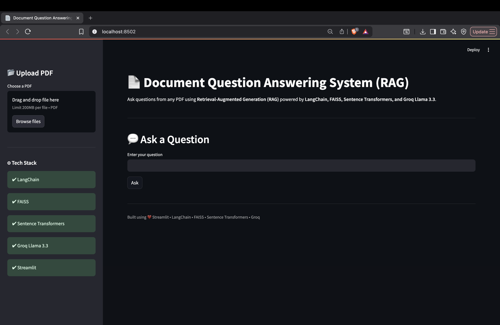
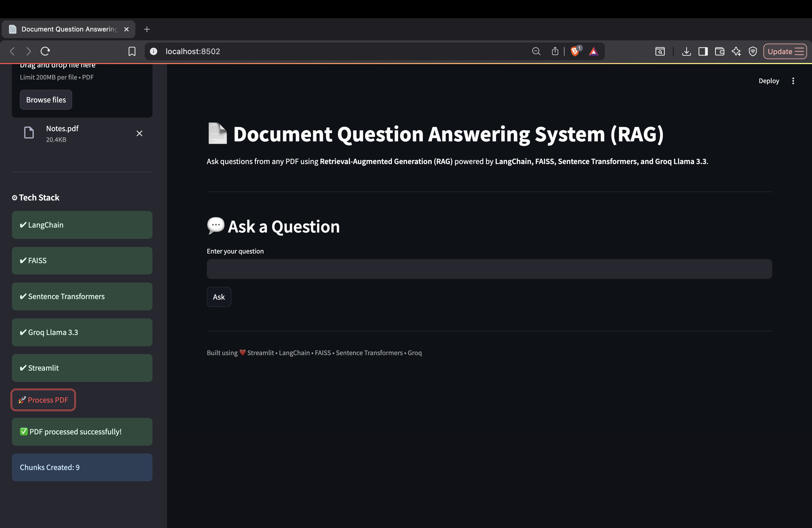
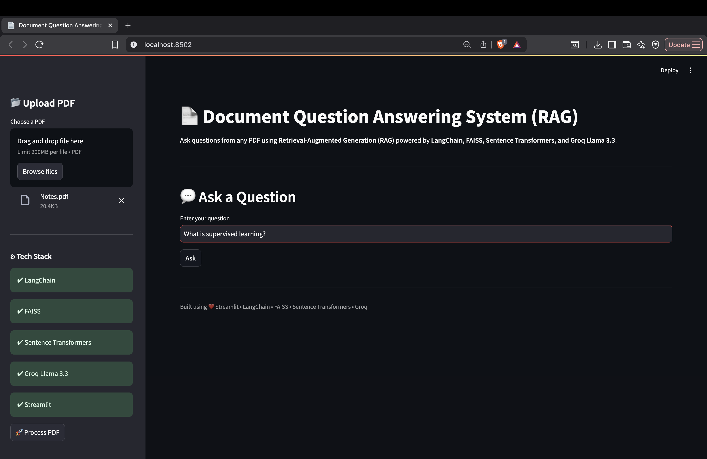
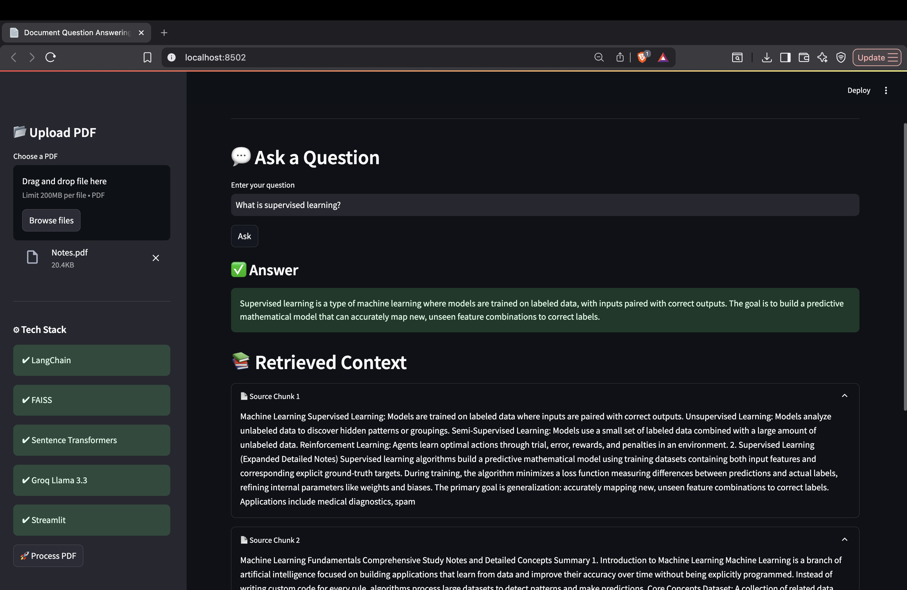

# 📄 Document Question Answering System (RAG)

<p align="center">


</p>

---

# 📌 Project Overview

This project is an end-to-end **Retrieval-Augmented Generation (RAG)** based Document Question Answering System developed using **LangChain**, **FAISS**, **HuggingFace Sentence Transformers**, **Groq LLM**, and **Streamlit**.

The application allows users to upload PDF documents, automatically processes the content into semantic embeddings, retrieves the most relevant document chunks using vector similarity search, and generates context-aware answers using a Large Language Model.

Unlike traditional chatbots, responses are generated strictly from the uploaded document, reducing hallucinations and improving factual accuracy.

---

# ✨ Features

- 📄 Upload PDF documents
- ✂️ Automatic document chunking
- 🧠 HuggingFace Embeddings
- 📚 FAISS Vector Database
- 🔍 Semantic Similarity Search
- 🤖 Groq LLM Response Generation
- 📑 Display Retrieved Context
- ⚡ Interactive Streamlit Interface
- 💻 Lightweight Local Deployment

---

# 📂 Repository Structure

```
.
│
├── app.py                 # Streamlit Application
├── rag_pipeline.py        # Complete RAG Pipeline
├── config.py              # API Configuration
├── requirements.txt       # Dependencies
├── Notes.pdf              # Sample PDF
├── images/
│     ├── architecture.png
│     ├── demo1.png
│     ├── demo2.png
│     ├── demo3.png
│     └── demo4.png
│
├── README.md
└── LICENSE
```

---

# ⚙️ System Architecture

```
             ┌──────────────────────────┐
             │      PDF Document        │
             └─────────────┬────────────┘
                           │
                           ▼
                 PDF Text Extraction
                           │
                           ▼
              Recursive Text Chunking
                           │
                           ▼
        HuggingFace Sentence Embeddings
                           │
                           ▼
              FAISS Vector Database
                           │
                           ▼
          Similarity Search (Top-k Chunks)
                           │
                           ▼
              Prompt Construction
                           │
                           ▼
                  Groq LLM (Llama3)
                           │
                           ▼
                Final Generated Answer
```

---

# 🔄 End-to-End Workflow

```
User Uploads PDF
        │
        ▼
Extract Text using PyPDFLoader
        │
        ▼
Split into Chunks
        │
        ▼
Generate Embeddings
        │
        ▼
Store inside FAISS
        │
        ▼
User asks Question
        │
        ▼
Retrieve Relevant Chunks
        │
        ▼
Build Prompt
        │
        ▼
Groq LLM
        │
        ▼
Return Answer + Retrieved Context
```

---

# 🛠 Tech Stack

| Component | Technology |
|------------|------------|
| Language | Python |
| UI | Streamlit |
| Framework | LangChain |
| Vector Store | FAISS |
| Embedding Model | HuggingFace Sentence Transformers |
| LLM | Groq (Llama3) |
| PDF Loader | PyPDF |
| Environment | Python Dotenv |

---

# 📊 Technical Specifications

| Component | Details |
|------------|----------|
| Chunk Size | 500 Characters |
| Chunk Overlap | 100 Characters |
| Vector Search | FAISS |
| Embeddings | all-MiniLM-L6-v2 |
| Similarity Search | Top-k Retrieval |
| User Interface | Streamlit |

---

# 📸 Application Screenshots

## Home Page



---

## PDF Uploaded Successfully



---

## Asking Questions



---

## Generated Answer with Retrieved Context



---

# ▶️ Installation

Clone the repository

```bash
git clone https://github.com/yourusername/Document-QA-RAG.git
```

Go inside project

```bash
cd Document-QA-RAG
```

Install dependencies

```bash
pip install -r requirements.txt
```

---

# 🔑 Environment Variables

Create a `.env` file

```
GROQ_API_KEY=YOUR_API_KEY
```

---

# ▶️ Run Application

```bash
streamlit run app.py
```

Open

```
http://localhost:8501
```

---

# 🧪 How to Use

### Step 1

Upload a PDF.

### Step 2

Click **Process PDF**.

### Step 3

Wait until vector embeddings are generated.

### Step 4

Ask questions related to the uploaded document.

### Step 5

View

- Generated Answer
- Retrieved Context Chunks

---

# 📈 Sample Output

**Question**

```
What is supervised learning?```

**Answer**

```
Supervised learning is a type of machine learning where models are trained on labeled data, with inputs paired with correct outputs. The goal is to build a predictive mathematical model that can accurately map new, unseen feature combinations to correct labels.
```

---

# 🚀 Future Improvements

- Chat History
- Multiple PDF Upload
- Source Citations
- Conversational Memory
- Hybrid Search (BM25 + Vector Search)
- Response Streaming
- Deploy on Streamlit Cloud
- Docker Support

---

# 📚 Learning Outcomes

Through this project, the following concepts were implemented:

- Retrieval-Augmented Generation (RAG)
- Vector Databases
- Semantic Search
- Prompt Engineering
- LangChain Pipelines
- Streamlit Application Development
- LLM Integration
- Document Intelligence

---

# 👨‍💻 Author

**Shreyash Rohidas Kedari**

Artificial Intelligence & Data Science Undergraduate

Dr. D. Y. Patil Institute of Technology, Pimpri

GitHub:
https://github.com/Shreyash3254

---

# 📜 License

This project is licensed under the MIT License.

---

## ⭐ If you found this project useful, consider giving it a Star!
